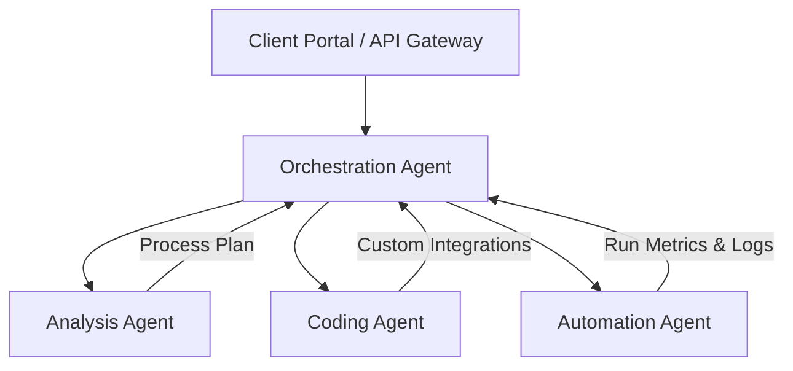

# Werk Agent Design

This document details the architecture, design patterns, roles, and communication protocols for the autonomous AI agents running within the Werk platform.

---

## Agent System Overview
Werk utilizes a multi-agent orchestration pattern where specialized agents work collaboratively to analyze business processes, write integration code, automate system workflows, and coordinate project execution.

---

## Agent Types & Roles

### 1. Orchestration Agent
*   **Role**: Command and control center of the platform.
*   **Responsibilities**:
    *   Coordinates task delegation across specialized agents.
    *   Manages global execution state and workflow histories.
    *   Handles routing of webhook triggers and system events.
    *   Executes automated rollback or error-recovery logic on task failures.

### 2. Analysis Agent
*   **Role**: Business analyst and process planner.
*   **Responsibilities**:
    *   Parses unstructured user requirements and business descriptions.
    *   Analyzes external API documentation to map endpoints.
    *   Generates step-by-step logic workflows and structured JSON execution plans.
    *   Identifies potential process bottlenecks and edge-cases.

### 3. Coding Agent
*   **Role**: Technical developer and system integrator.
*   **Responsibilities**:
    *   Generates secure code for custom webhooks, database triggers, and APIs.
    *   Builds automated unit tests and validates execution correctness.
    *   Diagnoses, debugs, and patches runtime errors or syntax issues.

### 4. Automation Agent
*   **Role**: Execution specialist.
*   **Responsibilities**:
    *   Executes business tasks across third-party tools (CRMs, Email, Document APIs).
    *   Pulls from and manages high-throughput background queue jobs.
    *   Handles rate-limiting, token refreshes, and API pagination during executions.

---

## Agent Communication & State Management
Agents coordinate asynchronously using an event-driven bus backed by **Supabase Realtime** and task queues:

*   **Task Dispatching**: The Orchestration Agent writes structured tasks to a `tasks` queue.
*   **Job Locking**: Individual agents listen to tasks matching their type, acquiring a lock to process the item.
*   **State Updates**: Agents emit progress and status events (`processing`, `completed`, `failed`) to update the global coordinator.
*   **Persistence**: All agent logs, state transitions, and outcomes are persisted in Supabase to provide full audit trails.
