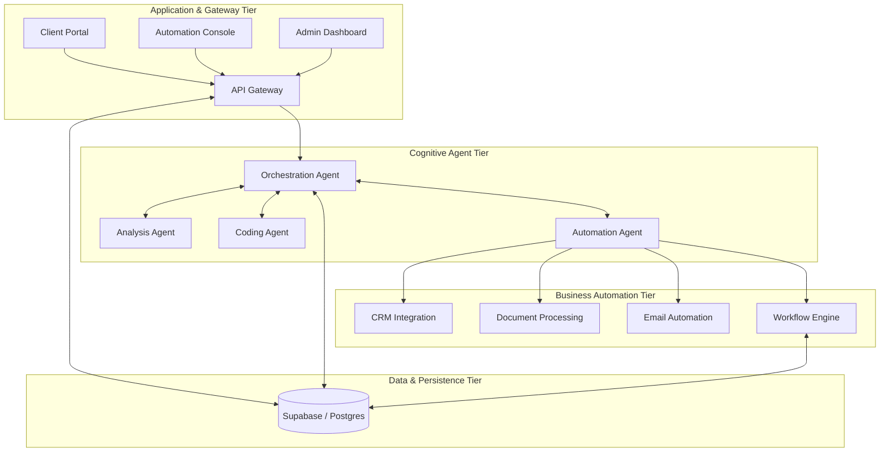

# Werk Project Architecture

This document provides a detailed overview of the system architecture of the **Werk** platform, highlighting the relationships between user applications, background automations, cognitive agents, and the persistent data tier.

---

## Architectural Overview

Werk is designed as a distributed, event-driven platform structured into four distinct tiers:

---

## Architectural Tiers

### 1. Application & Gateway Tier (`Apps/`)
This tier contains the customer-facing and operator-facing portals, as well as the entry point into the system:

*   **`API_Gateway`**: Centralized gateway that handles CORS, user authentication, request rate limiting, and routes API requests to either the background agents or direct database operations.
*   **`Client_Portal`**: A workspace for customers to input requirements, view active deliverables, request new tasks, and interact with the AI agents in real-time.
*   **`Automation_Console`**: A drag-and-drop workflow designer where users can visually map out automations, configure webhooks, and review step-by-step execution metrics.
*   **`Admin_Dashboard`**: Management console for billing, resource allocation, global system settings, and real-time observability of agent pipelines.

### 2. Cognitive Agent Tier (`Agents/`)
This is the intelligence layer of the system. Agents utilize LLMs to make decisions and coordinate work:

*   **`Orchestration`**: Coordinates task routing, schedules work, and monitors agent-to-agent communication.
*   **`Analysis_Agent`**: Breaks down incoming user requests into structural workflow steps.
*   **`Coding_Agent`**: Generates and compiles integration scripts on demand.
*   **`Automation_Agent`**: Manages execution state and talks to third-party APIs.

### 3. Business Automation Tier (`Automations/`)
The actual executors of business tasks, managed by the Automation Agent:

*   **`Workflow_Engine`**: A state-machine executor that runs multi-step automations, handles retries, delays, and conditional branching.
*   **`CRM`**: Houses integrations with systems like HubSpot and Salesforce (lead tracking, syncs, automated updates).
*   **`Document_Processing`**: Integrates OCR and document classification models to extract text from invoices, contracts, and receipts.
*   **`Email_Automation`**: Classifies inbound emails, drafts contextual responses, and auto-routes urgent tickets.

### 4. Data & Persistence Tier (Supabase)
Persists all platform configuration and execution states:

*   **PostgreSQL**: Secure relational database with Row Level Security (RLS) policies.
*   **Supabase Auth**: Authenticates users and generates JWTs.
*   **Supabase Realtime**: Enables instant notification to frontend portals of agent work progress.
*   **Storage**: Safely stores uploaded documents (e.g., invoices for processing).
